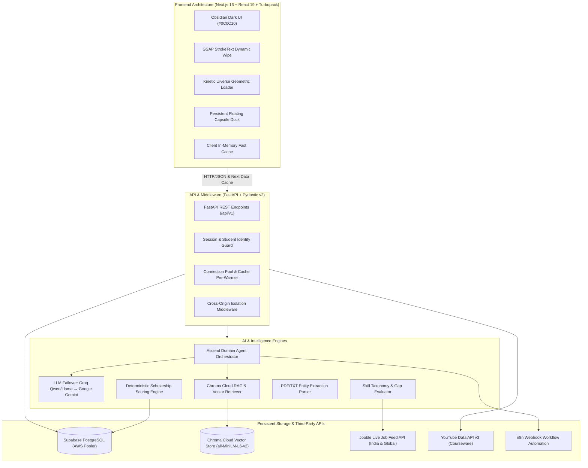
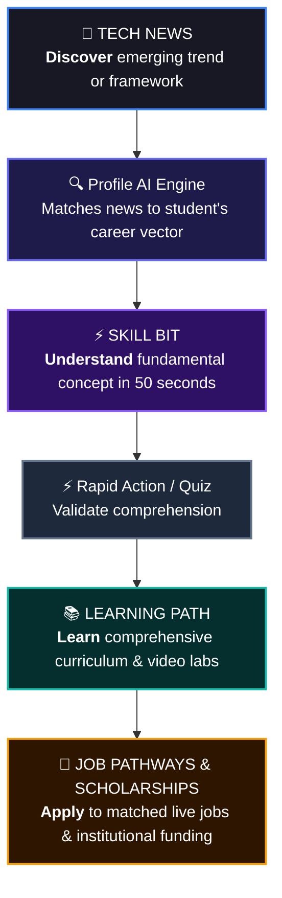
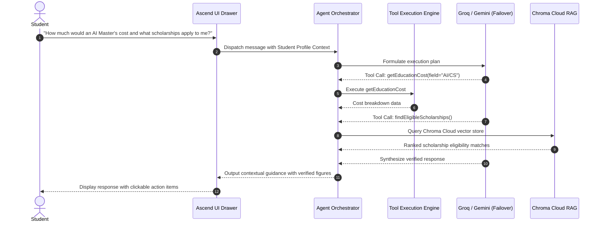

# ASCEND — AI-Powered Student Career & Education Intelligence Platform

[](https://fastapi.tiangolo.com)
[](https://nextjs.org/)
[](https://react.dev/)
[](https://trychroma.com)
[](https://groq.com)
[](https://ai.google.dev/)
[](https://n8n.io)
[](https://supabase.com)
[](https://tailwindcss.com/)

---

## 🌟 Executive Summary

**ASCEND** is an AI-powered student navigation and career acceleration platform. Engineered with an adaptive, verifiable student intelligence profile, ASCEND supports learners across educational tiers—from **Class 10 foundational exploration** and **Intermediate (+2) stream specialization** through **B.Tech / Higher Education professionalization**.

ASCEND connects academic achievement with institutional outcomes through **Chroma Cloud vector-retrieval (RAG)**, deterministic scholarship scoring, live industry job aggregation via Jooble, curriculum roadmaps with video coursework, **⚡ Skill Bits** (short-form technical micro-learning), **📰 Tech News** (personalized industry intelligence), and an autonomous **Domain-Based AI Agent** fortified with automated multi-LLM failover (Groq ↔ Google Gemini).

By connecting Tech News directly to Skill Bits, Skill Tracks, and Job Pathways, ASCEND establishes a powerful closed-loop product flywheel:  
$$\boxed{\textbf{Discover} \longrightarrow \textbf{Understand} \longrightarrow \textbf{Learn} \longrightarrow \textbf{Apply}}$$

---

## 🏛️ System Architecture



---

## 🚀 Core Pillars & Platform Capabilities

### 1. 🎯 Stage-Isolated Student Intelligence Profile
ASCEND rejects the "one-size-fits-all" model. The platform implements dynamic **State Isolation** across 3 distinct educational tiers:
- **Class 10**: Focuses on board examinations (CBSE/ICSE/State), academic percentage, stream inclinations (PCM, PCB, Commerce, Arts), and early talent scholarships.
- **Intermediate (11th/12th)**: Tracks stream branches, competitive entrance exams (JEE, NEET, CUET, NDA), regional domicile, and pre-university grants.
- **B.Tech / Higher Education**: Catalogs college/university credentials, engineering department/major, cumulative CGPA, graduation year (1st to 4th year), tech stack, and GitHub/LinkedIn portfolios.

#### Dual Onboarding Pathways:
- **Option A (AI Resume Extraction)**: Instant multi-page PDF/TXT parser extracting personal bio, graduation timeline, CGPA, technical skills, certifications, and GitHub projects.
- **Option B (Dynamic Stage Forms)**: Adaptive step-by-step wizard collecting validated demographic and institutional facts with real-time field validation.

---

### 2. 🏆 Personalized Scholarship Recommendation & Chroma Cloud RAG
ASCEND eliminates scholarship discovery fatigue through a hybrid recommendation pipeline:
- **Deterministic Multi-Factor Scoring**: Evaluates real eligibility criteria mathematically:
  - Exact percentage / CGPA vs. minimum scheme thresholds.
  - Current education stage requirement.
  - Annual family income caps (e.g., ₹2.5L, ₹6.0L, ₹8.0L).
  - Social category and minority eligibility (SC/ST/OBC/General/EWS).
  - State domicile requirements (All-India vs. state-specific mandates).
- **Chroma Cloud Vector Store & RAG**:
  - Cloud-hosted Chroma collection (`scholarships`) embedded via `all-MiniLM-L6-v2`.
  - Ingests government gazettes, corporate CSR mandates, and institution PDFs.
  - Performs semantic dense retrieval to resolve ambiguous criteria and extract deep nuances.
- **Auditable Match Breakdown**: Full transparency interface showing green checkmarks for fulfilled criteria and highlighted tags for missing eligibility requisites.

---

### 3. 💼 Live Job Pathways & Jooble Feed Integration
- **Live Industry Aggregation**: Integrates with the **Jooble API** for real-time live vacancy feeds across India and global tech hubs.
- **Dual Sector Categorization**: Segregates opportunities into **Private Sector Tech/Non-Tech** (Startups, MNCs) and **Government / PSU Roles** (GATE PSU, Banking, UPSC, Engineering Services).
- **Skill Fit & Gap Analysis**:
  - Compares student's active skills against job requirements.
  - Generates match score, identifies critical missing proficiencies, and highlights market CTC benchmarks.
- **1-Click "Save Roadmap"**: Enables students to convert any target job vacancy directly into a tracked learning milestone in their personal profile.

---

### 4. 📚 Dynamic Skill Tracks & YouTube Video Courseware
- **Curated Curriculums**: Translates career goals into structured step-by-step milestones (e.g., Full Stack Development, Data Science, Cloud & DevOps, Embedded Systems).
- **YouTube Data API Integration**: Fetches relevant playlists, lectures, and hands-on modules directly mapped to each skill domain.
- **Built-in Video Player & Progress Tracking**: Students watch courseware inside an ambient, distraction-free theatre modal with persistent progress checkpoints.

---

### 5. ⚡ Skill Bits — Rapid Technical Micro-Learning
**Skill Bits** is ASCEND's short-form technical micro-learning engine designed for high-density knowledge acquisition.
- **The Philosophy**: *"I have 60 seconds. Teach me something truly useful."*
- **Format**: High-impact, vertical reel-style technical breakdowns delivered in **30 to 60 seconds**.
- **How it works**:
  $$\text{Choose a Skill} \longrightarrow \text{Watch Skill Bit} \longrightarrow \text{Master 1 Core Concept} \longrightarrow \text{Quick Interactive Check} \longrightarrow \text{Continue or Deep Dive}$$
- **Curated Skill Bit Examples**:
  - `What is an API?` — 40 sec
  - `JWT Authentication Explained` — 50 sec
  - `What is RAG (Retrieval-Augmented Generation)?` — 55 sec
  - `Git Merge vs. Rebase` — 45 sec
  - `Binary Search in Action` — 60 sec
  - `Docker Containers in 45 Seconds` — 45 sec
  - `What is a Large Language Model (LLM)?` — 50 sec
- **Strategic Value**: Skill Bits do not replace deep courses—they serve as high-converting discovery hooks that demystify intimidating concepts before students plunge into comprehensive curriculum roadmaps.

---

### 6. 📰 Tech News — Profile-Curated Industry Intelligence
Rather than a generic RSS firehose, **Tech News** is an intelligent industry radar curated specifically around the student's enrolled education stage, active skills, and target career pathway.

#### Core Intelligence Domains:
- 🤖 **AI & Machine Learning** (LLMs, Foundation Models, Multi-Agent Frameworks)
- 💻 **Software Development** (Modern Frameworks, Runtime Architecture, System Design)
- ☁️ **Cloud & DevOps** (Kubernetes, Serverless, Infrastructure as Code)
- 🔐 **Cybersecurity** (Zero Trust, Application Security, Threat Intelligence)
- 📊 **Data Science** (Vector Search, Feature Engineering, Distributed Compute)
- 🚀 **Startups & Venture Capital** (Ecosystem Funding, Product Launches)
- 💼 **Jobs & Market Hiring** (Hiring Surges, Emerging Roles, Compensation Shifts)
- 🧑‍💻 **Developer Tools** (Compilers, Toolchains, Observability)
- 📱 **Emerging Technologies** (Quantum, Edge AI, AR/VR)

#### Contextual Enrichment Layer:
Every incoming news item is augmented with real-time career relevancy metadata:
- **Why This Matters**: E.g., *"A new open-source agent framework was released — directly impacting Generative AI application development."*
- **Related Skills**: `LLM APIs` · `RAG` · `Vector Databases` · `FastAPI`
- **Instant Actions**:
  - ⚡ *Watch related Skill Bit*
  - 📚 *Open matched AI Learning Path*
  - 💼 *Explore live vacancies requiring these tools*

---

### 7. 🔥 The Unified Product Engine: Discover → Understand → Learn → Apply
Rather than treating News, Reels, Roadmaps, and Job Portals as disconnected silos, ASCEND binds them into an uninterrupted **Knowledge & Career Flywheel**:



$$\boxed{\textbf{Discover (Tech News)} \longrightarrow \textbf{Understand (Skill Bits)} \longrightarrow \textbf{Learn (Skill Tracks)} \longrightarrow \textbf{Apply (Jobs & Grants)}}$$

---

### 8. 🤖 Autonomous Domain-Based AI Agent (Ascend AI Assistant)
ASCEND features a dedicated, multi-turn AI Agent specifically fine-tuned for education and career advisory:



#### Specialized Agent Capabilities:
- **9 Domain-Specific Tools**:
  1. `getEducationCost`: Accurate tuition, living costs, and budget estimation.
  2. `getSalaryEstimate`: Fresher and experienced CTC benchmarks and package trends.
  3. `calculateEducationROI`: Payback period and break-even calculations.
  4. `compareCareerPathways`: Empirical comparison between degrees/paths (e.g., M.Tech vs. MCA).
  5. `findEligibleScholarships`: Student-tailored grant discovery.
  6. `checkScholarshipEligibility`: Rule-by-rule criterion verification.
  7. `calculateSkillGap`: Target role skill differential analysis.
  8. `searchJobs`: Live vacancy lookup via Jooble.
  9. `searchKnowledgeBase`: Semantic RAG retrieval over institutional documentation.
- **High-Availability Multi-LLM Failover**:
  - **Primary**: Ultra-low latency Groq inference (`qwen/qwen3.8-27b` & `llama-3.3-70b-versatile`).
  - **Automatic Failover**: Seamless circuit breaker that switches to **Google Gemini API** (`gemini-flash-latest`) upon rate limits (HTTP 429) or upstream latency spikes.
- **n8n Automation Engine**: Triggers background webhooks for automated welcome flows, progress digests, and scholarship deadline alerts.

---

## ✨ Design Engineering & Frontend Aesthetics

- **Obsidian Dark Theme (`#0C0C10`)**: High-contrast, accessibility-tested color space with neon violet (`#8B5CF6`), amber gold (`#F59E0B`), and cyan (`#22D3EE`) accents.
- **GSAP Dynamic StrokeText**: Custom SVG kinetic typography that renders animated character strokes and smooth wipe-fills on brand elements and student identity banners.
- **Uiverse Kinetic Box Loader**: Pure CSS geometric transforming loader for zero-jank, visually engaging page transitions and API hydration states.
- **Responsive Floating Capsule Dock**: Persistent navigation capsule enabling instantaneous switching between Overview, Opportunities, Pathways, and Profile Hub.

---

## 📁 Repository Structure

```text
careerforge/
├── backend/
│   ├── app/
│   │   ├── api/v1/
│   │   │   ├── endpoints/
│   │   │   │   ├── assistant.py       # Ascend AI Agent router
│   │   │   │   ├── auth.py            # Session & account management
│   │   │   │   ├── jobs.py            # Jooble live job search & match
│   │   │   │   ├── profile.py         # Student profile lifecycle & stats
│   │   │   │   ├── rag.py             # Chroma Cloud RAG query & ingestion
│   │   │   │   ├── resume.py          # PDF/TXT resume parser
│   │   │   │   ├── scholarships.py   # Deterministic scholarship matcher
│   │   │   │   └── skill_tracks.py    # Curated roadmaps & YouTube modules
│   │   │   └── router.py              # Root API v1 router
│   │   ├── core/
│   │   │   ├── cache.py               # In-memory TTL caching engine
│   │   │   ├── config.py              # Pydantic BaseSettings & env parser
│   │   │   └── database.py            # SQLAlchemy engine & session maker
│   │   ├── models/                    # SQLAlchemy ORM models
│   │   ├── schemas/                   # Pydantic v2 validation models
│   │   ├── seeds/                     # Database migrations & seed pipelines
│   │   ├── services/
│   │   │   ├── agent/                 # Multi-tool LLM Agent Orchestrator
│   │   │   ├── rag/                   # Chroma Cloud store & text chunking
│   │   │   ├── groq_service.py        # Groq client with Gemini failover
│   │   │   ├── jooble_service.py      # Jooble API client
│   │   │   ├── n8n_service.py         # Event automation webhook client
│   │   │   ├── resume_parser.py       # OCR & regex document parser
│   │   │   └── scholarship_matcher.py # Multi-criteria eligibility evaluator
│   │   └── main.py                    # FastAPI application & lifespan startup
│   ├── requirements.txt
│   └── tests/                         # Pytest test suite
│
└── frontend/
    ├── src/
    │   ├── app/
    │   │   ├── dashboard/             # Main student command center
    │   │   │   ├── scholarships/      # Matched opportunity drill-down
    │   │   │   ├── skill-tracks/      # Interactive courseware & videos
    │   │   │   └── page.tsx           # Dashboard root
    │   │   ├── jobs/                  # Live job pathways & search
    │   │   ├── login/                 # Authentication & onboarding entry
    │   │   ├── onboarding/            # Stage-isolated onboarding wizard
    │   │   ├── profile/               # Complete student dossier
    │   │   ├── scholarships/          # Public scholarship preview directory
    │   │   ├── globals.css            # Tailwind v4, tokens & kinetic loader
    │   │   ├── layout.tsx             # Root layout with Navbar & BottomBar
    │   │   └── loading.tsx            # Global Route Suspense with BoxLoader
    │   ├── components/
    │   │   ├── common/                # AscendLogo, StrokeText, BoxLoader, AiAssistantModal
    │   │   ├── dashboard/             # OverviewCards, CareerPathwaysModal
    │   │   ├── jobs/                  # JobPathCards, JobFitModal
    │   │   ├── layout/                # Navbar, BottomBar
    │   │   ├── onboarding/            # BTechForm, IntermediateForm, Class10Form
    │   │   └── profile/               # ProfileSectionModal
    │   ├── lib/                       # API client & stage isolation configs
    │   └── types/                     # TypeScript domain models
    └── package.json
```

---

## 🛠️ API Reference Table

| Method | Endpoint | Description |
|---|---|---|
| `GET` | `/health` | Server heartbeat & database connectivity check |
| `POST` | `/api/v1/auth/session` | Create or resume authenticated student session |
| `POST` | `/api/v1/profile/create` | Initialize verified student intelligence profile |
| `GET` | `/api/v1/profile/{id}` | Fetch full student profile with completeness metrics |
| `PATCH` | `/api/v1/profile/{id}` | Update stage-specific academic & skill attributes |
| `POST` | `/api/v1/resume/extract` | Parse resume document (PDF/TXT) into structured JSON |
| `GET` | `/api/v1/scholarships/preview` | Stage-filtered institutional scholarships catalog |
| `GET` | `/api/v1/scholarships/match/{student_id}` | Ranked scholarships with audit breakdown |
| `GET` | `/api/v1/jobs/search` | Query live Jooble vacancies with stage & skill filters |
| `POST` | `/api/v1/jobs/match` | Evaluate candidate fit score against specific job role |
| `GET` | `/api/v1/skill_tracks/roadmaps/{stage}` | Retrieve structured learning roadmaps with YouTube lectures |
| `POST` | `/api/v1/assistant/chat` | Interact with the Domain AI Agent with tool execution |
| `POST` | `/api/v1/rag/query` | Perform dense vector similarity search in Chroma Cloud |

---

## ⚙️ Environment Variables

# Database (Supabase PostgreSQL Connection Pooling)
DATABASE_URL=postgresql://<user>:<password>@<pooler-host>:5432/postgres
ENVIRONMENT=development
RUN_MIGRATIONS_ON_STARTUP=false
RUN_SEEDS_ON_STARTUP=false

# Security & Authentication
JWT_SECRET_KEY=your_jwt_signing_secret_min_32_chars
ACCESS_TOKEN_EXPIRE_MINUTES=1440

# Primary AI Reasoning Engine (Groq)
GROQ_API_KEY=your_groq_api_key
GROQ_MODEL=llama-3.3-70b-versatile

# Automatic Failover AI Engine (Google Gemini)
GEMINI_API_KEY=your_gemini_api_key
GEMINI_MODEL=gemini-flash-latest
GEMINI_BASE_URL=https://generativelanguage.googleapis.com/v1beta/openai

# Chroma Cloud Vector Database
CHROMA_USE_CLOUD=true
CHROMA_API_KEY=your_chroma_cloud_key
CHROMA_TENANT=your_tenant_id
CHROMA_DATABASE=GlobalHackathon
CHROMA_COLLECTION_NAME=scholarships
EMBEDDING_MODEL=all-MiniLM-L6-v2

# Live Industry Feeds & Media
JOOBLE_API_KEY=your_jooble_api_key
JOOBLE_API_URL=https://jooble.org/api
YOUTUBE_API_KEY=your_youtube_v3_api_key

# Event Automation (n8n Cloud)
N8N_WEBHOOK_URL=https://your-instance.app.n8n.cloud/webhook/ascend-welcome
N8N_WEBHOOK_ENABLED=false
FRONTEND_BASE_URL=http://localhost:3000
```

---

## 🚀 Quickstart Guide

### 1. Prerequisites
- **Node.js**: v18.0.0 or higher
- **Python**: v3.10 or higher
- **Package Managers**: `npm` & `pip`

### 2. Database Migrations & Seeding (Decoupled Process)
Database migrations and seed data are decoupled from application startup to ensure rapid boot times and prevent concurrent replica write conflicts:
```bash
# Apply schema migrations (adds password_hash and schema updates)
python -m backend.app.manage migrate

# Seed baseline catalogs (idempotent, safe to rerun)
python -m backend.app.manage seed
```

### 3. Backend Setup
```bash
# Navigate to backend directory
cd backend

# Install dependencies
python -m pip install -r requirements.txt

# Launch FastAPI development server with auto-reload
python -m uvicorn app.main:app --host 127.0.0.1 --port 8000 --reload
```
- API root: `http://127.0.0.1:8000`
- Interactive Swagger UI: `http://127.0.0.1:8000/docs`
- ReDoc Documentation: `http://127.0.0.1:8000/redoc`

### 4. Frontend Setup
```bash
# Navigate to frontend directory
cd frontend

# Install dependencies
npm install

# Start Next.js with Turbopack
npm run dev
```
- Web Application: `http://localhost:3000`

### 5. Running Automated Tests
```bash
# Execute Backend Pytest suite (Auth, IDOR, AI Fallback, RAG Security)
python -m pytest backend/tests/test_auth_and_security.py -v

# Execute Frontend automated test suite
cd frontend && npm test
```

---

## 🔒 Security & Reliability Architecture

- **Bcrypt Password Security & JWT Authentication**: User passwords are cryptographically hashed using standard bcrypt (cost factor 12) before persistence. JWT access tokens encode issued-at and expiration claims with strict verification.
- **Strict IDOR (Insecure Direct Object Reference) Prevention**: Reusable FastAPI security dependencies verify that the authenticated identity matches the requested resource for all student-specific data (profiles, scholarships, saved jobs, conversation history).
- **Asynchronous AI Reliability & Bounded Fallback**: AI orchestrators utilize `AsyncGroq` with bounded 4.0s timeout budgets and non-blocking event loops. Rate limits (HTTP 429) automatically fail over to Google Gemini or structured fallback analysis.
- **RAG Prompt Injection Defense**: Documents retrieved from vector databases are strictly isolated inside `<untrusted_retrieved_context>` blocks and treated as passive untrusted data, preventing prompt extraction or instruction overrides.
- **SQLAlchemy Connection Pooling**: Utilizes Supabase transaction-level connection pooling to prevent connection starvation under concurrent requests.
- **Decoupled Lifespan Operations**: Application startup is separated from schema DDL migrations and database seeding, ensuring zero cold-start bottlenecks.

---

## 📄 License
Developed for the **opti forge 26** — Engineered by Palamoor Adithya Goud & Team.  
Distributed under the MIT License.
